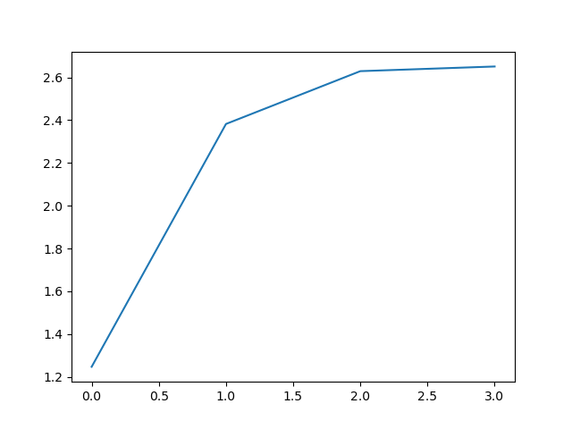

# K-Means Algorithm

## kmeans.py

Contains objects definitions for KMeans and Cluster, which defines all the data points utilized to process the algorithm.

## kutils.py

Contains useful functions utilized both in kmeans.py and the example in main.py

## main.py

Contains an *example* plotting 2D graphs of the algorithm, while raising the number of clusters.
The variance is calculated and with it we can plot the *elbow plot*, utilized to recognize the best **K** variable to use.

## Elbow Plot
  

Consists of the plotting of the reduction in total variation (of the clusters) for each K variable used, being that all algorithms measured iterates only once (epoch=1)